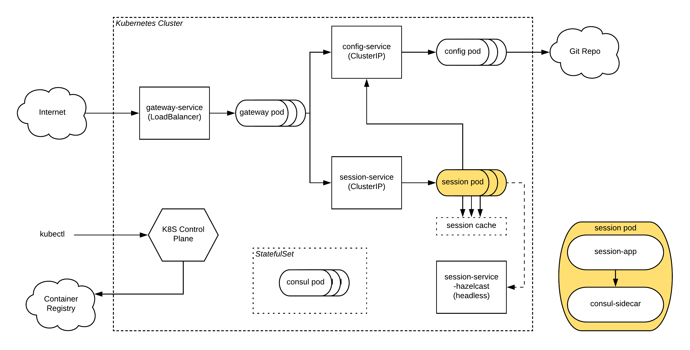

autoscale: true

## APEX - Kubernetes evaluation

---

## Why containers?

* More efficient hardware utilization
* Same full-stack execution environment as builds are promoted
* Accelerated deployment
  * Infrastructure can change more dynamically
  * Self-service options for developers

---

## Comparisons

---
## Why Kubernetes

* Right level of abstraction
  * don't have to manage low-level details (patching VMs, allocating storage/CPU/memory)
  * still have visibility into environment, still have control to customize vs other PaaS options (Heroku, Cloud Foundry)
* Applications are treated universally
  * Docker image containing entire execution environment
  * YAML descriptor
  * Language agnostic 

---
## Why Kubernetes (continued)

* Infrastructure as code
  * All entities (pods/deployments/service/volumes) are declaratively described
  * Version controlled with standard SCM tools
  * Configuration can be templatized for repeatability in CD pipeline
* Orchestration
  * Scheduler manages where and how many containers to spin up
  * Failed containers are replaced
  * Managed deployments with pause/resume/rollback

---

## What is Kubernetes?

Open-source Container Orchestration system

* Capabilities
  * Manages scheduling of containers (bin-packing problem)
  * Automatic replacement of failed containers
  * Automated deployments using a variety of strategies
  * Networking and storage primitives

---

## (Very) brief history

* Google's project Borg
  * https://ai.google/research/pubs/pub43438
  * Open sourced as Kubernetes in 2014

* Cloud Native Computing Foundation (CNCF)
  * Founded 2015
  * https://www.cncf.io/
  * Vendor-neutral nexus for 'cloud-native' Github projects
  * Training, meetups, news

---

## Comparison of Concepts

| Datacenter | K8S |
| --- | --- |
| VIP | Service |
| Release | Deployment |
| VM | Pod |
| Application | Container |
| Storage | PersistentVolume |

---

## Logical architecture

---

## Components

---

## Control plane
* API server for executing commands
* Scheduler to assign pods to nodes
* Etcd (consensus-based HA datastore) to maintain cluster state
* Multi-master support for HA
* Master nodes may run pods, but typically do not

---
## Master

---

## Nodes
* run containers in "pods"
* kubelet - start/stop pods, provide pods status to control plane
* cAdvisor - collects system-level metrics
* kube-proxy - implements network abstraction layer for containers

---

## Nodes

---

## APEX Requirements

Service Discovery
Leadership Election
K/V Store
Persistent Storage
Security (single-use card)

---

## Operational Requirements

* Monitoring and alerting
  * Application
  * Container
  * Node
  * Cluster
* Log aggregation

---

## Not in Scope (yet)

Not considered so far

* Database
* AMQ
* Fusion / Solr / Mongo

---

## Deployments

Implicitly creates a replica set
Defines a specific number of pods with specified template  
Failed pods will be automatically replaced

---

## Deployment strategies - Rolling Upgrade

---

## Deployment strategies - Blue / Green

---

## Deployment strategies - Canary

---

## Demo using GKE in GCP

^ Show session-service running locally
Make a small change, increment version
Build/push docker image
Update deployment version, rollout

---

## Next steps

CI/CD pipeline
Monitoring / Alerting (Prometheus?)
Affinity rules
point-to-point encryption
Certificate authorities
Shared PersistentVolumes (maybe..)
Customized base Docker image (Bridge2 CA's, security hardening, Java agents, etc)
